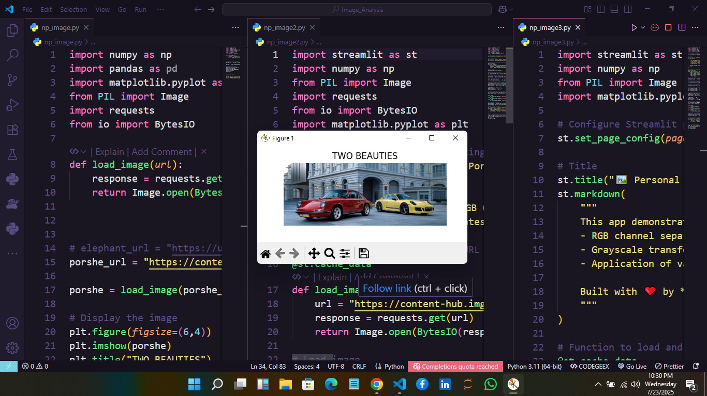

# 🖼️ Image Channel Visualizer

**An interactive RGB channel visualizer and colormap transformer using Streamlit, NumPy, Pillow, and Matplotlib.**

This project demonstrates how to separate RGB channels, convert images to grayscale, and apply various colormaps — all through intuitive web apps.

---

## 🚀 Features

- 🟥🟩🟦 RGB Channel Separation  
- 🧠 Grayscale Image Conversion  
- 🎨 Interactive Matplotlib Colormap Application  
- 📷 Works with both remote and personal local images  
- ⚡ Built with Streamlit for real-time interaction

---

## 📂 Project Structure

```bash
.
├── src/
│   ├── np_image.py               # Base image loader + NumPy array conversion
│   ├── np_image2.py              # Porsche image Streamlit app
│   └── np_image3.py              # Personal image Streamlit app
├── outputs/
│   ├── Porsche Image Processor.pdf
│   ├── Image Channel Visualizer - by Mubasshir.pdf
│   └── Image Channel Visualizer - snapshot.png
├── README.md
```

---

## 🖼️ App Snapshot



---

## 📦 Tech Stack

| Technology | Purpose |
|------------|---------|
| **Streamlit** | Web app UI |
| **NumPy**     | Array manipulation |
| **Pillow (PIL)** | Image loading & processing |
| **Matplotlib** | Visualization of colormaps |

---

## 📄 Outputs

The visual results of the apps are included under the `/outputs/` directory for easy reference.

- `Porsche Image Processor.pdf`
- `Image Channel Visualizer - by Mubasshir.pdf`

---

## 🧠 Author

**Mubasshir Ahmed**  
Crafted with curiosity and code.

---

## 📌 How to Run Locally

1. Clone the repository:
```bash
git clone https://github.com/your-username/image-channel-visualizer.git
cd image-channel-visualizer/src
```

2. Install dependencies:
```bash
pip install -r requirements.txt
```

3. Run Streamlit apps:
```bash
streamlit run np_image2.py   # For Porsche visualizer
streamlit run np_image3.py   # For personal image visualizer
```

---

## 🏁 License

This project is licensed under the MIT License.
